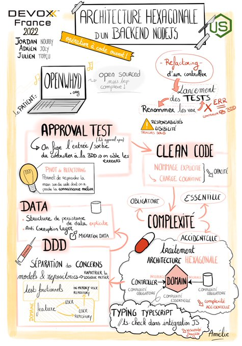
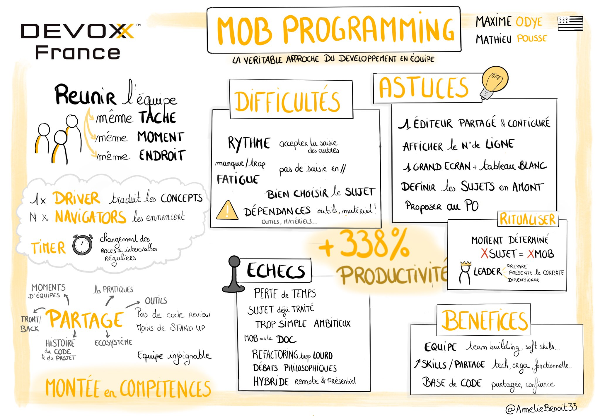

# Devoxx 20222

## Jour 1

### Théories des catégories. Vous la connaissez déja

Appliquer la théories mathématique des **catégories** au développement logiciel.
Elle s'appuie sur la théories des ensembles.
Objectif:

Application ->  Ensemble de services -> ensemble de fonctions.

Ces fonctions auraient un certain nombre de propriétés
* Composition de fonctions
* Distributivité (On place les parentheses où l'on veut : `h.(g.f) = (h.g).f`

Ceci permet d’écrire une code plus souple.

Une catégories :
* deux ensemble **E** et **F**
* des fonction transformant des objets de **E** vers **F**
* Une fonction identitée `id(x)=x`

Un **Monoïde** est une catégorie de **E** vers lui-même.
Un **monoîde** Contient une **élément neutre**.
On peut écrire un **monoîde** sous cette forme `{Ensemble, fonction ,Élement neutre}`.

Quelques exemples :
* `{Int, +, 0}`
* `{Int, *, 0}`
* `{String, *, ""}`
* `{List, add(), []}`

Pour généraliser on a également parlé de **Functor** et **Monade**. qui sont une peut des application des théories de catégories à elle-même.
Elles permèttent d'écrire du code plus générique, en manupulant des types générique et des ensembles.
Une **Monade** est un **monoïde** à ce miveau.
Quelques exemples de **monades** :
* `{Stream<T>, map}`
* `{Optional<T>, map}`

### Tester vos méthodes de refactoring sur la machine d'entrainement TCR

Test && commit || revert

Méthodologiet d'entrainement pour apprendre a tester/refactorer step by step
si ton teste plante => revert du code de production

### Intégration a l'ère du Cloud avec Camel Quarkus

Présentation rapide de Camel. Perment de transférer / manipuler de flux d'une application à une autre. 
Fournit un petit DSL java pour cela.

### Redonnez l'agilité à vos dévoloppeurs

Bien accompagner l'arrivée d'un développeur
Prendre son temps pour comprendre les problèmes.

### Reprenez le condrol de votre Bash en devenant un Ninja de la CLI

Liste de différents qu'on peut installer dans le shell pour simplifier son application.

## Jour 2

### Slow tech : Il est urgent de hacker le système

dans 30 plus d'ordi si on continue ainsi.

Mitiger high tech avec slow tech.

### Et si les micro-services n'avaient rien à voir avec la technique

Présentation de la loi De Conway.

Vos applications sont drivés par la communication intra-entreprise.

Presentation de 4 dyfférents type d'équipes et de leurs communications
Une équipe :
* responsabilité claire
* possède un bout de logiciel

4 types d'équipes :
* **Stream align** : _you build it, you run it_.
* **Endling Team** : support pour l'équipe
* **Complicated suggestion** : apport une expertise spécificique
* **Plateform team** : Fournit des outils pour accélérer la livraision

3 type de communication :
* Collaboration
* Facilitation
* As a service

### Model Driven Design

Présentation intéressante pour ceux qui connaissait déjà le DDD. Trop rapide pour les autres

Présentation de Deep Model et du Supple Design

Le **deep Model** est un modèle qui correspond fortement au métier.

**Breakthrough** Quand le développeur réussit à comprendre en profondeur le métier. Cette étape difficile à atteindre permet souvent une simplification importante du modèle tout en augmentant son expressivité.

**Supple design** est un ensemble de technique pour rendre le modèle solide et souple : 
* Séparation commande/query
* Immutablité
* Assertions

Ateliers : 
* Event storming
* Example mapping

### Dois-je migrer en Reactive et comment ?

La plus grande parties de cette conférence concernait sur une présentation de Spring reactor/webflux.

Il est conseillé d'utilisé la programmation réactive pour la scalibité et non pour les performances

### Micronaut AOT : OPtimiter vos applications pour la JIT et GraalVM

Micronaut AOT est un concurrent à GraalVM.
Comment Micronaut permet d’optimiser son execution par un grand nombre de traitement à la compilation
* Calcul de la réflexivité
* Transformation de yaml en Java
* Suppression de dépendances inutiles

Micronaut AOT permet quand à lui d'optimiser l'éxécution sur la machine cible. C'est pour la prod et non pour le dévolopeur.

Il va récupérer les infos de la machine cible. Infos qu'il peut calculer ou qu'on peut lui donner. A partir de là , il va virer tout ce qui est inutile.

### Continious Delivery on premise : Gerrit, Jenkins et Sonarqube entre dans un bar

Rex sur l'automatisation de la chaine de condinious delivery.
commit ->  création PR -> build Jenkins -> Analyse Sonarqube.
Systeme de vote pour la PR
* Vote de Jenkins
* Vote de Sonarqube
* Vote manuel
Si vote positif -> Merge automatique -> Deploiement sur env de staging

### S'affranchir de la pyramide de tests

La pyramide de test est-elle efficace ?
Retour d'expérience chez Doctolib.
La politique : faites des tests de US. il peuvent être UT, TI ou E22
Constat : 
* Les tests E2E sont moins cassant qu'avant
* les tests E2E peuvent être exécutés plus rapidement
  * 3 statégies d'exécution :
    * mono thread
    * Massivement //
    * // Avec sélactions
* les tests unitaires créent un contrat d'interfaces. Comment gérer un changement d'interfaces ?

### The unknown of Junit 5

Explications rapide des nouvelles fonctionnalités de Juint5
* Tests parametrés
* nommage des tests
* Creation des Extensions

### Rex TDD et testContainers

Comment utiliser testContainer dans un contexte Java

### Architecture hexagonal nodeJS

## Jour 3

### Découper mon monolithe

Trouver les différents domaines
Savoir en base quelles tables/champs appartiennent à quel domaine
Ajouter une foncitonnalité a coté du monolythe.
Découvertes des bubble contextes. Comment ils communiques ?
* par BDD (A Éviter)
* Par query d'API
* Par Commande d'API
* Par flux d'état
* Par Évènements
* Par notifications + Commande d'api

### Mob programming

### En quềte du clean code avec Sonar : 20 000 Lieues sous un océan de code

Je n'ai pas appris grand chose. Sonar tente de voir plus large et s'orient vers le clean code.
Considère de regarder le nouveau code. 
Corriger au plus prèt de la sources et donc utiliser sonarlint puis au commit

### 400 endoits d'API et 2000 types : génèse ut utilisation du nouveau client Java pour ElasticSearch

Reflection sur une API très complexe pour simplifier sont utilisation.
Écriture d'une nouveau client plus intuitif dans lequel on peut utiliser la puissance d'autocompletion des IDE.
Règles :
* On ne veut pas que l'utilisateur ait a Deviner un nom de classe
* On ne veut pas que l'utilisateur ait des imports (hors ceux de base) à faire
* On veut avoir une correspondance forte entre le code java et json.

Pour celà ils ont eut l'idée d’utilser les lambdas et le pattern Builder.